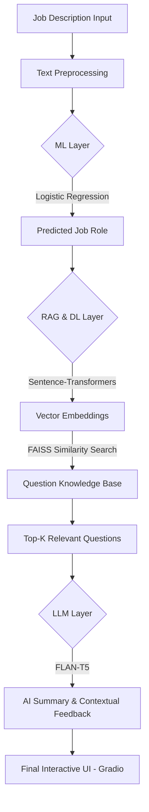

# 🚀 Smart AI Interviewer: An End-to-End AI System
### *ML Prediction + DL Embeddings + RAG Retrieval + LLM Feedback*

---

## 🌟 Executive Summary
The **Smart AI Interviewer** is a state-of-the-art AI application designed to automate and intelligentize the recruitment process. Unlike traditional keyword-based systems, this project implements a multi-layered architecture combining **Traditional Machine Learning**, **Deep Learning (Sentence Embeddings)**, **Retrieval-Augmented Generation (RAG)**, and **Large Language Models (LLMs)** to provide a human-like interview experience.

---

## 🏗 System Architecture
The following diagram illustrates the flow of data through our integrated AI pipeline:



---

## 🛠 Technical Deep Dive: The "Why" Behind the Tech

### 1. Machine Learning (ML) Layer
*   **Algorithm**: Logistic Regression with TF-IDF Vectorization.
*   **Why?**: For text classification with high-dimensional data (like job descriptions), Logistic Regression provides excellent interpretability and efficiency. We used **TF-IDF (Term Frequency-Inverse Document Frequency)** to extract the statistical importance of technical keywords, ensuring the model focuses on relevant skills rather than common stop words.

### 2. Deep Learning (DL) & Embeddings
*   **Model**: `all-MiniLM-L6-v2` (Sentence-Transformers).
*   **Why?**: Traditional ML only understands words, but DL understands **semantics**. By using a transformer-based embedding model, our system can understand that a "Software Engineer" description is semantically close to "Java Developer" questions, even if the exact words differ.

### 3. Retrieval-Augmented Generation (RAG)
*   **Vector Database**: FAISS (Facebook AI Similarity Search).
*   **Why?**: RAG ensures that the system doesn't "hallucinate." Instead of the LLM generating random questions, the RAG layer retrieves **real, verified questions** from our CSV knowledge base using high-speed vector similarity search. This guarantees accuracy and technical relevance.

### 4. Large Language Models (LLM)
*   **Model**: `google/flan-t5-small`.
*   **Why?**: To make the system "intelligent" and conversational. The LLM summarizes the interview requirements and provides real-time feedback on candidate answers, making the application feel like a real human interviewer.

---

## 📂 Repository Breakdown
*   📂 `data/`: Curated datasets for Job Descriptions, MCQs, and Essay Questions.
*   📂 `src/`:
    *   `preprocessing.py`: Handles data cleaning, symbol removal, and normalization.
    *   `model_trainer.py`: Implementation of ML classification and evaluation (F1-score, Accuracy).
    *   `rag_system.py`: The Deep Learning core using FAISS for semantic retrieval.
    *   `llm_engine.py`: Integration with HuggingFace transformers for generative tasks.
*   📜 `app.py`: The premium Gradio interface representing the final product.
*   📜 `Smart_AI_Interview.ipynb`: A step-by-step Data Science workflow notebook.

---

## 📊 Data Science Methodology
This project follows the industry-standard lifecycle:
1.  **Data Acquisition**: Collecting job and question datasets.
2.  **Cleaning & EDA**: Treating missing values and analyzing class distributions.
3.  **Feature Engineering**: Custom text cleaning and TF-IDF selection.
4.  **Model Optimization**: Hyperparameter tuning and evaluation using confusion matrices and F1-scores.
5.  **Deployment**: Serving the model via a responsive web application.

---

## 🚀 Getting Started

1.  **Install Dependencies**:
    ```bash
    pip install -r requirements.txt
    ```
2.  **Launch the Application**:
    ```bash
    python3 app.py
    ```
3.  **Explore the Notebook**: Open `Smart_AI_Interview.ipynb` to see the internal logic and evaluation metrics.

---

## 🎓 Academic Compliance
This project was developed to exceed the requirements of the **SUPER AGENT Data Science Syllabus**, demonstrating proficiency in:
- Python Fundamentals & Data Manipulation (Pandas/NumPy).
- Machine Learning Lifecycle & Metrics.
- NLP Pipelines & Deep Learning Embeddings.
- Modern RAG & LLM Implementation.
