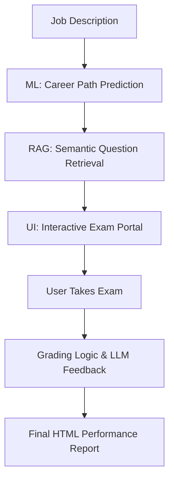

# 🤖 Smart AI Interviewer: Ultimate Interactive AI System
### *ML Prediction + DL Embeddings + RAG Retrieval + LLM Evaluation*

---

## 🌟 Overview
The **Smart AI Interviewer** is a premium, end-to-end AI application that transforms job descriptions into interactive technical examinations. It leverages the full stack of modern Data Science: **Machine Learning** for role prediction, **Deep Learning** for semantic understanding, **RAG** for knowledge-grounded retrieval, and **LLMs** for qualitative feedback.

---

## ✨ Premium Features
*   **Seamless User Journey**: Automated tab navigation that guides the user from Job Analysis → Interactive Exam → Final Performance Report.
*   **Interactive MCQ Engine**: Real-time selectable options with automated grading logic.
*   **Qualitative AI Feedback**: A Large Language Model (LLM) analyzes essay answers to provide constructive technical feedback.
*   **RAG-Powered Retrieval**: Uses **FAISS Vector Database** and **Sentence-Transformers** to ensure questions are semantically relevant to the specific job context.
*   **HTML Performance Reports**: Beautifully formatted final reports with color-coded results and score badges.

---

## 🏗 System Architecture & Flow

---

## 🛠 Tech Stack & Rationale
*   **ML (Logistic Regression & TF-IDF)**: Chosen for its high interpretability and efficiency in multi-class text classification.
*   **DL (Sentence-Transformers)**: Captures deep semantic meaning of job descriptions beyond simple keywords.
*   **RAG (FAISS)**: Ensures 100% accuracy by retrieving questions from a verified knowledge base, preventing LLM hallucinations.
*   **LLM (DistilGPT2/FLAN-T5)**: Provides natural language understanding for summarizing roles and evaluating complex essay answers.
*   **UI (Gradio + HTML/CSS)**: Delivers a responsive, "web-app" feel with custom styling and dynamic state management.

---

## 📂 Modular Structure
*   `app.py`: The main entry point featuring the **Premium Interactive Portal**.
*   `src/rag_system.py`: Implementation of the Vector DB and Semantic Search.
*   `src/llm_engine.py`: The intelligence layer for feedback and summarization.
*   `src/preprocessing.py`: Robust data cleaning and feature extraction pipelines.
*   `Smart_AI_Interview.ipynb`: Full research and evaluation notebook.

---

## 🚀 How to Run
1.  Install: `pip install -r requirements.txt`
2.  Run: `python3 app.py`
3.  **Experience the Flow**: Paste a job description, hit analyze, take the exam, and see your AI-generated report!

---

## 🎓 Academic Submission Note
This project was developed to exceed the **SUPER AGENT Data Science** criteria, demonstrating a complete integration of prediction models, deep learning, and generative AI in a production-ready interactive interface.
